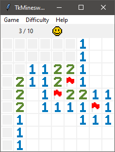

<!-- PROJECT LOGO -->
 

  

  <h3 align="center">Tk Minesweeper</h3>

  

    <a href="https://github.com/malyjak/TkMinesweeper"><strong>Explore Repository »</strong></a>
  

<!-- TABLE OF CONTENTS -->

  
Table of Contents

  <ol>
    <li>
      <a href="#about-the-project">About The Project</a>
      <ul>
      	<li><a href="#developers">Developers</a></li>
      </ul>
    </li>
    <li>
      <a href="#getting-started">Getting Started</a>
      <ul>
      	<li><a href="#supported-platforms">Supported Platforms</a></li>
        <li><a href="#prerequisites">Prerequisites</a></li>
      </ul>
    </li>
    <li>
      <a href="#release-history">Release History</a>
    </li>
  </ol>

<!-- ABOUT THE PROJECT -->
## About The Project

This project simulates the minesweeper game that used to come with Windows OS distribution.

## Developers

* <a href="https://github.com/malyjak">malyjak</a>

<!-- GETTING STARTED -->
## Getting Started

As a general user You can directly use platform specific installers inside the `\releases` folder.

For development You can run the `tk_minesweeper.py` as any other python file.

### Supported Platforms

* Windows
* Linux
* macOS

### Prerequisites

* Python3 with tkinter

<!-- RELEASE HISTORY -->
## Release History

* 1.0
	* ADDITIONS: README, LICENSE
	* CHANGES: Fixed recursive revealing bugs.
